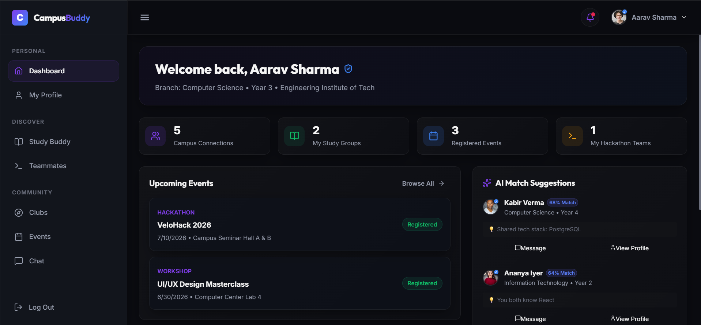

## 🖥️ Dashboard Preview

<p align="center">
  
</p>

<p align="center">
  <i>The central hub where students can discover opportunities, connect with communities, and stay updated with everything happening across campus.</i>
</p>
<div align="center">

# 🎓 CampusBuddy

### Connecting Students. Building Communities. Simplifying Campus Life.

[]()
[]()
[]()
[]()
[]()

**A platform designed to make campus life more connected by helping students discover opportunities, join communities, share resources, and stay updated—all in one place.**

🌐 **Live Demo:** https://campusbuddy.vercel.app

</div>

---

# 📖 Overview

CampusBuddy is a student-first platform built to eliminate fragmented campus communication.

Instead of relying on scattered WhatsApp groups, notice boards, and social media pages, CampusBuddy brings everything happening across campus into one organized platform where students can interact, collaborate, and never miss an opportunity.

Whether it's discovering upcoming events, joining student communities, asking academic questions, sharing study resources, or finding internship opportunities, CampusBuddy serves as a digital hub for college life.

---

# ✨ Features

### 👥 Student Communities
- Join interest-based communities
- Connect with seniors and peers
- Participate in discussions

### 💬 Discussion Forum
- Ask questions
- Solve doubts
- Share knowledge
- Community-driven discussions

### 📅 Campus Events
- Discover upcoming events
- Technical workshops
- Hackathons
- Cultural festivals
- Club activities

### 🎯 Opportunities
- Internship updates
- Placement drives
- Scholarships
- Competitions
- Open-source programs

### 📚 Resource Sharing
- Notes
- Previous year papers
- Study materials
- Coding resources

### 🔔 Campus Updates
- Important announcements
- Academic notices
- Department notifications

### 🔍 Search
Quickly search for:

- Communities
- Posts
- Events
- Resources
- Opportunities

---

# 🚀 Why CampusBuddy?

Most colleges communicate through multiple platforms:

- WhatsApp Groups
- Telegram Channels
- Notice Boards
- Instagram Pages
- Club Discord Servers

As a result, students often miss important announcements, opportunities, and events.

CampusBuddy solves this by bringing the entire campus ecosystem into one unified platform.

---

# 🛠 Tech Stack

| Frontend | Backend | Database | Deployment |
|-----------|----------|-----------|------------|
| React | Firebase | Firestore | Vercel |
| Vite | Firebase Auth | Cloud Storage | GitHub |

---

# 📂 Project Structure

```
CampusBuddy
│
├── public/
├── src/
│   ├── assets/
│   ├── components/
│   ├── pages/
│   ├── hooks/
│   ├── context/
│   ├── services/
│   ├── utils/
│   └── App.jsx
│
├── package.json
├── vite.config.js
└── README.md
```

---

# ⚙️ Installation

Clone the repository

```bash
git clone https://github.com/yourusername/campusbuddy.git
```

Go inside the project

```bash
cd campusbuddy
```

Install dependencies

```bash
npm install
```

Start development server

```bash
npm run dev
```

---

# 🔥 Environment Variables

Create a `.env` file.

```env
VITE_FIREBASE_API_KEY=

VITE_FIREBASE_AUTH_DOMAIN=

VITE_FIREBASE_PROJECT_ID=

VITE_FIREBASE_STORAGE_BUCKET=

VITE_FIREBASE_MESSAGING_SENDER_ID=

VITE_FIREBASE_APP_ID=
```

---

# 🎯 Future Roadmap

- AI-powered campus assistant
- Smart event recommendations
- Real-time chat
- Club management dashboard
- Attendance integration
- Faculty portal
- Campus marketplace
- Lost & Found section
- Anonymous confession forum
- Alumni networking
- Mobile application

---

# 🤝 Contributing

Contributions are welcome.

If you would like to improve CampusBuddy:

1. Fork the repository
2. Create a new branch
3. Commit your changes
4. Push your branch
5. Open a Pull Request

---

# 💡 Vision

Our vision is to build a unified digital campus ecosystem where students can collaborate, learn, grow, and access every opportunity without information being scattered across multiple platforms.

---

# 📜 License

This project is licensed under the MIT License.

---

# 👨‍💻 Author

**Gulshan Kumar**

B.Tech Information Technology

If you found this project helpful, consider giving it a ⭐ on GitHub.
